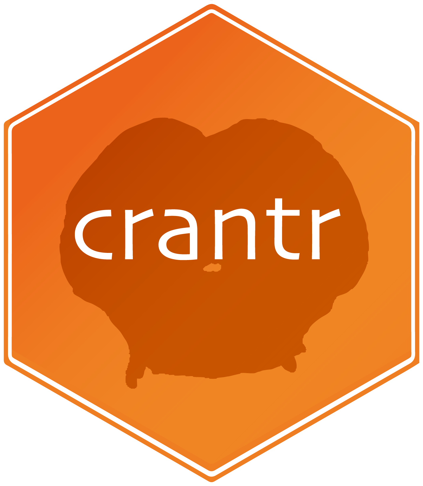

<!-- badges: start -->
[](https://natverse.github.io)
[](https://flyconnectome.github.io/crantr/reference/)
[](https://github.com/flyconnectome/crantr/actions/workflows/R-CMD-check.yaml)
<!-- badges: end -->
crantr 
===========

**crantr** is an R package designed to support the analysis of connectome data sets for the clonal raider ant (*Ooceraea biroi*, formerly *Cerapachys biroi*). The package primarily focuses on proofread auto-segmentation data from the [CRANT (Clonal Raider Ant) project](https://proofreading.zetta.ai/info/api/v2/datastack/full/kronauer_ant?middle_auth_url=proofreading.zetta.ai%2Fsticky_auth).

The project was founded as a collaboration between the laboratories of [Wei-Chung Allen Lee](https://www.lee.hms.harvard.edu/), 
[Daniel Kronauer](https://www.rockefeller.edu/our-scientists/heads-of-laboratories/988-daniel-kronauer/) and [Hannah Haberkern](https://www.research-in-bavaria.de/research-news/details/article/new-junior-research-group-hannah-haberkern-investigates-navigation-in-flies-and-ants/),
among others.

This project has a community based in the [CRANT slack](https://app.slack.com/client/T07RC68DXQA/C07S10GRL9W). Equivalent python tools are available [here](https://social-evolution-and-behavior.github.io/crantpy/intro.html). Publication-quality plots can be made with [nat.ggplot](https://github.com/natverse/nat.ggplot?tab=readme-ov-file).


### About Clonal Raider Ants

Clonal raider ants (*Ooceraea biroi*) are a fascinating species of ant known for their unique reproductive biology and social structure:

- They reproduce clonally via parthenogenesis.
- They lack a queen caste, and all workers in the colony lay eggs.
- They exhibit complex social behaviors, including division of labor, chemical communication, and cooperative parental care.
- It is possible to make [mutant](https://www.cell.com/fulltext/S0092-8674(17)30772-9) and [transgenic](https://www.cell.com/cell/fulltext/S0092-8674(23)00544-5) ants to explore the neural and genetic basis of behaviors.

These characteristics make clonal raider ants an excellent model system for studying the neural basis of social behavior and the evolution of eusociality in insects.

### Current Data Availability

At present, the connectome data for one brain is available: **CRANTb**, which represents the brain of a worker clonal raider ant.

## Package Features

The **crantr** package serves as a wrapper over the [fafbseg](https://github.com/natverse/fafbseg) package, the wrapper adds:

1. Setup of necessary default paths / data redirects.
2. Integration with [CAVE tables](https://proofreading.zetta.ai/info/) for storing various annotation information.
3. Relevant helper functions called from the [bancr](https://github.com/flyconnectome/bancr) package.
3. CRANT project specific data wrangling and browsing code.


## Installation

You can install the development version of `crantr` from GitHub:

```r
remotes::install_github('flyconnectome/crantr')
remotes::install_github('natverse/fafbseg@asb-dev')
```

### Authorisation

To use the **crantr** package, you need authorisation to access CRANT resources. 

Follow these steps to set up your access CAVE token, if you have been given authorisation:

```r
# Set up token - will open your browser to generate a new token
crant_set_token()

# If you already have a token:
# crant_set_token("<my token>")
```

### Verifying Setup

To ensure everything is set up correctly, run:

```r
# Diagnose issues
fafbseg::dr_fafbseg()

# Confirm functionality
crant_islatest("576460752684030043")
```

### Python Dependencies

Some functions rely on underlying Python code. To install the full set of recommended libraries, including `fafbseg-py`, run:

```r
fafbseg::simple_python("full")
```

If you encounter errors related to cloud-volume, update it with:

```r
fafbseg::simple_python('none', pkgs='cloud-volume~=8.32.1')
```

## Usage

Use `with_crant()` to wrap additional `fafbseg::flywire_*` functions for use with CRANT data. Alternatively, use `choose_crant()` to set all `flywire_*` functions from `fafbseg` to target CRANT.

Example:

```r
library(crantr)
choose_crant()

# Your analysis code here
```

## Updating

To update the package and all dependencies:

```r
remotes::install_github('flyconnectome/crantr')
```

To update a specific Python library dependency:

```r
fafbseg::simple_python(pkgs='fafbseg')
```

## Tutorial

One of the initial projects with the CRANTb dataset is to explore the olfactory system of the ant, led by [Lindsey E Lopes](https://www.linkedin.com/in/lindsey-e-lopes-a16a3292) in the [Laboratoy of Social Evolution and Behavior](https://www.rockefeller.edu/research/2280-kronauer-laboratory/). 

Let us look at some antennal lobe projection neurons.

If you are a collaborator on the project and have access to our [seatable](https://cloud.seatable.io/workspace/62919/dtable/CRANTb/?tid=0000&vid=0000), you can do this:


```
# load library
library(crantr)

# get meta data, will one dya be available via CAVE tables
ac <- crant_table_query()

# have a look at it!
View(ac)

# filter to get our IDs
pn.meta <- ac %>%
  dplyr::filter(cell_class=="olfactory_projection_neuron")
  
# get our ids
pn.ids <- unique(pn.meta$root_id)
```

If not, here are some neuron IDs to get started:

```r
# load library
library(crantr)

# specify IDs to examine, could also be gotten from a CAVE table
pn.ids <- c("576460752684030043", "576460752688452399", "576460752688452655", 
"576460752666304186", "576460752683636730", "576460752724736013")

# update these IDs to their most current versions, they change after each proofreading edit
pn.ids <- crant_latestid(pn.ids)
```

Now we can read mesh data for these reconstructions and plot them together with a surface model of the `CRANTb` brain, using `rgl`!

```r
# fetch
pn.meshes <- crant_read_neuron_meshes(pn.ids)

# plot brain
crant_view()
plot3d(crantb.surf, col = "lightgrey", alpha = 0.1)

# plot neurons
plot3d(pn.meshes)
```


We can also make this plot in 2D, in the popular `ggplot2` framework.

```r
# ggplot
crant_ggneuron(pn.meshes , volume = crantb.surf)
```


Sometimes it is also useful for work with skeletons, for example for NBLASTing neurons. We can swiftly fetch the L2 skeletons of a neuron,
built from its super-voxel locations using the python library [pcg_skel](https://github.com/AllenInstitute/pcg_skel), as so:

```r
# fetch
pn.skels <- crant_read_l2skel(pn.ids)

# plot brain
nopen3d()
crant_view()
plot3d(crantb.surf, col = "lightgrey", alpha = 0.1)

# plot neurons
plot3d(pn.skels, lwd = 1)
```


## Meta data management in seatable


Seatable is a powerful way to make collaborative annotations in this connectome dataset and we encourage you to use it rather than keeping your own google sheets or similar to track neurons.
It works similarly to google sheets, but has better filter views, data type management, programmatic access, etc. 
It should work in the browser and as an [app](https://seatable.io/en).

See our seatable [here](https://cloud.seatable.io/workspace/62919/dtable/CRANTb/?tid=0000&vid=0000).
If this link does not work you can request access by contacting Lindsey Lopes.

Each row is a `CRANTb` neuron. If you hover your tool-tip over the **i** icon in each column header, you can see what that column records.
Each neuron is identified by its unique 16-digit integer `root_id`, which is modified each time the neuron is edited.
As `CRANTb` is an active project, this happens frequently so our seatable needs to keep track of changes, which it does on a daily schedule.

The update logic is `position` (voxel space) -> `supervoxel_id` -> `root_id`.
If `position` and `supervoxel_id` are missing, `root_id` is updated directly but this is longer. 
It will also take the most up to date `root_id` with the most number of voxels from the previous root_id, so if a neuron is split this could be the incorrect choice. 
Updating from `position` gives you the neuron at that position, regardless of its size, merges or splits.
Best practice is to add position always if you can, and `root_id` in addition if you want. 
You may want to add only `root_id` alone if you want to track a neuron but do not yet have a good position for it. 
A good position is a point on the neuron that you expect not to change during proofreading, e.g. the first branch point in the neuron where it splits from the primary neurite into axon and dendrite.


You can access the seatable programmatically using the `crantr`, if you have access.

```r
remotes::install_github('flyconnectome/crantr')
library(crantr)
```

You will first need to obtain your authorised login credentials, you only need to do this once:

```r
crant_table_set_token(user="MY_EMAIL_FOR_SEATABLE",
               pwd="MY_SEATABLE_PASSWORD",
               url="https://cloud.seatable.io/")
```

And then you may read the data, and make nice plots from it!

```r
# Read BANC meta seatable
ac <- crant_table_query()
```

You can also update rows automatically. Be careful when doing this. If you want to be sure not to mess something up, 
you can take a 'snapshot' of the seatable before you edit it in the browser, which will save a historical version.

You can then change columns in `ac`, keeping their names, as you like. Then to update via R:

```r
# Update
crant_table_update_rows(base="CRANTb", 
                     table = "CRANTb_meta", 
                     df = ac.new, 
                     append_allowed = FALSE, 
                     chunksize = 100)
```


To update, you must have the seatable identifier for each column in `ac.new`, i.e. an `_id` column.

This method is good for bulk uploads/changes.

You can also make a quick, simpler update, replacing one column's entries with a given `update` for a set of root IDs.

```r
crant_table_annotate(root_ids = c("576460752667713229",
                               "576460752662519193",
                               "576460752730083020",
                               "576460752673660716",
                               "576460752662521753"),
                  update = "lindsey_lopes",
                  overwrite = FALSE,
                  append = FALSE,
                  column = "user_annotator")
```

## Data Acknowledgment

When using CRANT data, please acknowledge it in accordance with the [CRANT community guidelines](https://github.com/jasper-tms/the-CRANT-fly-connectome/wiki/) and in agreement with the CRANT consortium.

## Citations

If you use this package, please cite:

1. The upcoming CRANT paper (TBD)
2. The natverse paper: [Bates et al. 2020](https://elifesciences.org/articles/53350)
3. This R package:

```r
citation(package = "crantr")
```

**Bates A** (2024). _crantr: R Client Access to the Brain And Nerve Cord (CRANT) Dataset_. R package version 0.1.0, <https://github.com/flyconnectome/crantr>.

Note, a similar python-based tool is available [here](https://social-evolution-and-behavior.github.io/crantpy/intro.html).

## Acknowledgements

- CRANTb data set: Lindsey E. Lopes and David G.C. Hildebrand prepared the clonal raider ant brain sample. The EM dataset was collected at Harvard Medical School in the [laboratory of Wei-Chung Allen Lee](https://www.lee.hms.harvard.edu/), by Wangchu Xiang, Mohd Mazri, and Lindsey E. Lopes.
- Segmentation and synapse prediction: Built by [Zetta.ai](https://zetta.ai/).
- Neuron reconstruction: Hosted and supported by the laboratory of Wei-Chung Allen Lee at Harvard Medical School, the laboratory of Hannah Haberkern at University of Würzburg, and the Laboratory of Social Evolution and Behavior at The Rockefeller University.
- R package: Initialized using the [fancr](https://github.com/flyconnectome/fancr) package developed by Greg Jefferis at the MRC Laboratory of Molecular Biology, Cambridge, UK.
- Development: Alexander S. Bates worked on this R package while in the laboratory of Rachel Wilson at Harvard Medical School.

## References

**Bates, Alexander Shakeel, James D. Manton, Sridhar R. Jagannathan, Marta Costa, Philipp Schlegel, Torsten Rohlfing, and Gregory SXE Jefferis**. 2020. *The Natverse, a Versatile Toolbox for Combining and Analysing Neuroanatomical Data.* eLife 9 (April). https://doi.org/10.7554/eLife.53350.
